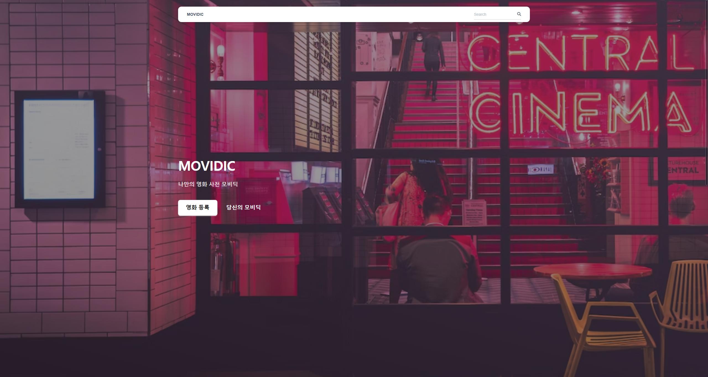
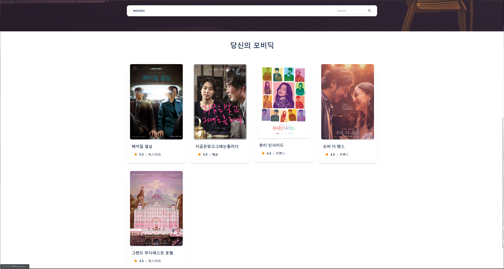
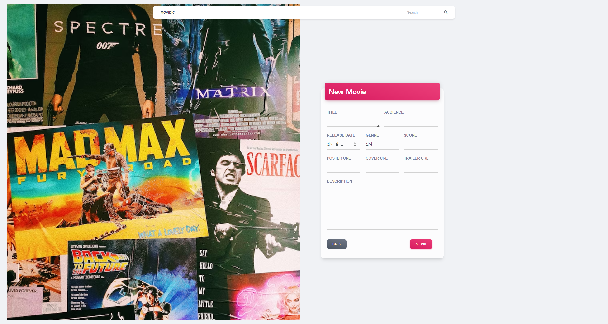
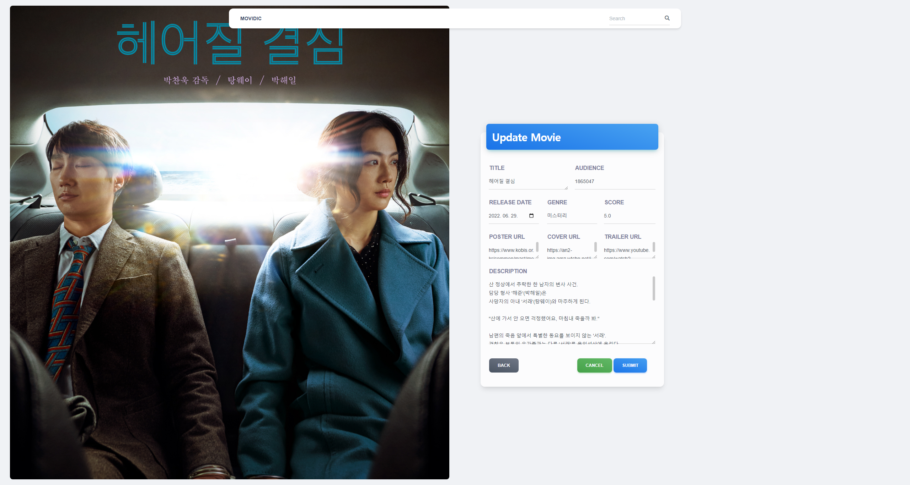
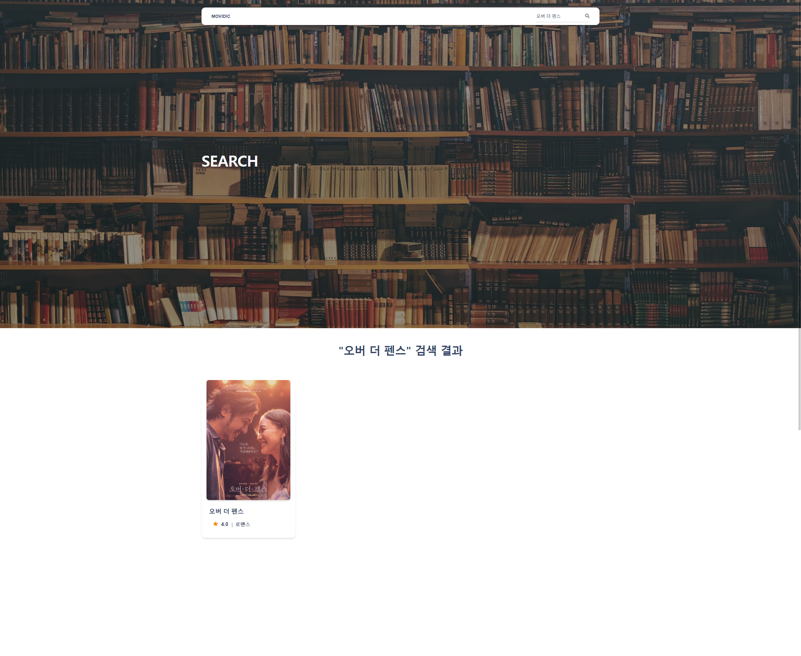

# Django Project: MOVIDIC
기억에 남는 인생 영화에 대한 정보와 평가를 저장하고 조회할 수 있는 서비스입니다.

<br>



<br>

### 프로젝트 목표
* 데이터를 생성,조회,수정,삭제할 수 있는 Webapplication제작
* Djangoweb framework를 사용한 데이터 처리
* DjangoModel과 ORM에 대한 이해
* Django ModelForm을 활용한 사용자 요청 데이터 유효성 검증

<br>

### 사용 기술
   
  
   
   
  

<br>

### 프로젝트 구조
📦05_pjt<br>
 ┣ 📂movies<br>
 ┃ ┣ 📂migrations<br>
 ┃ ┃ ┣ 📜0001_initial.py<br>
 ┃ ┃ ┗ 📜__init__.py<br>
 ┃ ┣ 📂templates<br>
 ┃ ┃ ┗ 📂movies<br>
 ┃ ┃ ┃ ┣ 📜create.html<br>
 ┃ ┃ ┃ ┣ 📜detail.html<br>
 ┃ ┃ ┃ ┣ 📜index.html<br>
 ┃ ┃ ┃ ┣ 📜search.html<br>
 ┃ ┃ ┃ ┗ 📜update.html<br>
 ┃ ┣ 📜admin.py<br>
 ┃ ┣ 📜apps.py<br>
 ┃ ┣ 📜forms.py<br>
 ┃ ┣ 📜models.py<br>
 ┃ ┣ 📜tests.py<br>
 ┃ ┣ 📜urls.py<br>
 ┃ ┣ 📜views.py<br>
 ┃ ┗ 📜__init__.py<br>
 ┣ 📂mypjt<br>
 ┃ ┣ 📜asgi.py<br>
 ┃ ┣ 📜settings.py<br>
 ┃ ┣ 📜urls.py<br>
 ┃ ┣ 📜wsgi.py<br>
 ┃ ┗ 📜__init__.py<br>
 ┣ 📂static<br>
 ┃ ┗ 📂css<br>
 ┃ ┃ ┣ 📜material-kit.min.css<br>
 ┃ ┃ ┗ 📜nucleo-icons.css<br>
 ┃ ┗ 📂js<br>
 ┃ ┃ ┣ 📜bootstrap.min.js<br>
 ┃ ┃ ┣ 📜material-kit.min.js<br>
 ┃ ┃ ┗ 📜popper.min.js<br>
 ┣ 📂templates<br>
 ┃ ┗ 📜base.html<br>
 ┣ 📜.gitignore<br>
 ┣ 📜db.sqlite3<br>
 ┣ 📜manage.py<br>
 ┣ 📜README.md<br>
 ┗ 📜requirements.txt<br>

<br>

---

## 00_Model

<br>

| 필드명       | 데이터 타입 | 역할             |
| -------------| ------------|------------------|
| title        | varchar(20) | 영화 제목        |
| audience     | integer     | 관객 수          |
| release_date | date        | 개봉일           |
| genre        | varchar(30) | 장르             |
| score        | float       | 평점             |
| poster_url   | text        | 포스터 경로      |
| cover_url    | text        | 커버 이미지 경로 |
| trailer_url  | text        | 예고편 경로      |
| description  | text        | 줄거리           |

<br>

---

## 01_Index

<br>




<br>

> `MOVIDIC`의 `index`페이지입니다.<br>
> 서비스를 소개하는 `header`영역과, 등록한 영화 정보를 확인할 수 있는 `section`영역으로 이루어져 있습니다.<br>
> 영화 카드를 클릭하면, 해당 영화의 상세 페이지로 이동됩니다.

<br>

* `views.index`<br>
  페이지가 요청되면, 등록된 영화 전체 데이터들을 `QuerySet`으로 반환하여 페이지를 렌더링합니다.
  ```python
    @require_safe
    def index(request):
        movies = Movie.objects.all()
        context = {
            'movies': movies,
        }
        return render(request, 'movies/index.html', context)
  ```

<br>

---

## 02_Create

<br>



<br>

> 영화 정보를 등록할 수 있는 `create` 페이지 입니다.<br>
> `index` 페이지의 `영화 등록` 버튼을 클릭하여 접근 가능합니다.<br>
> `Submit` 버튼으로 제출하면 등록한 영화의 상세 페이지로 이동됩니다.

<br>


* `views.create`<br>
  `Submit`으로 제출된 데이터들을 `DB`에 저장합니다.<br>
  `POST` 방식으로 요청이 들어왔을 때만, `form`의 유효성 검증을 합니다.<br>
  유효성 검증을 통과하면 새로운 영화 데이터를 저장하고, 해당 영화 상세 페이지로 리다이렉트시킵니다.<br>
  유효성 검증을 통과 못했거나, `GET` 방식으로 요청이 들어온 경우엔 `create` 페이지로 이동합니다.<br>
  ```python
    @require_http_methods(['GET', 'POST'])
    def create(request):
        if request.method == 'POST':
            form = MovieForm(request.POST)
            if form.is_valid():
                movie = form.save()
                return redirect('movies:detail', movie.pk)
        else:
            form = MovieForm()
        context = {
            'form': form,
        }
        return render(request, 'movies/create.html', context)
  ```

<br>

---

## 03_Detail

<br>


    
<br>

> 등록된 영화의 상세 내용을 조회하는 `detail` 페이지입니다.<br>
> 해당 영화에 해당하는 커버 이미지와 포스터 이미지가 출력되며, 트레일러를 감상할 수 있는 링크 버튼도 있습니다.<br>
> 해당 영화 데이터를 수정이나 삭제 할 수 있는 버튼도 마지막에 출력됩니다.<br>

<br>

* `views.detail`<br>
  요청과 함께 넘어 온 `pk`로 영화를 특정하고, 해당 영화 데이터로 페이지를 렌더링합니다.

  ```python
    @require_safe
    def detail(request, pk):
        movie = Movie.objects.get(pk=pk)
        context = {
            'movie': movie,
        }
        return render(request, 'movies/detail.html', context)
  ```

<br>

---

## 04_Update

<br>



<br>

> 등록된 영화의 상세 내용을 수정할 수 있는 `update` 페이지입니다.<br>

<br>

* `views.update`<br>
  `create`와 마찬가지로, `POST` 방식으로 요청이 들어왔을 때는 `form`의 유효성 검증 후 해당 영화의 상세 페이지로 이동합니다.<br>
  `GET` 방식의 요청이 들어오거나, 유효성 검증을 통과하지 못한 경우는 다시 `update` 페이지로 리다이렉트시킵니다.<br>

  ```python
    @require_http_methods(['GET', 'POST'])
    def update(request, pk):
        movie = Movie.objects.get(pk=pk)
        if request.method == 'POST':
            form = MovieForm(request.POST, instance=movie)
            if form.is_valid():
                form.save()
                return redirect('movies:detail', movie.pk)
        else:
            form = MovieForm(instance=movie)
        context = {
            'form': form,
            'movie': movie,
        }
        return render(request, 'movies/update.html', context)
  ```
  
<br>

---

## 05_Delete

<br>

> 특정 영화 정보를 삭제하기 위한 `url`입니다.<br>

<br>

* `views.delete`<br>
  `detail` 페이지에서 삭제 요청을 통해 함께 받아온 데이터의 `pk`로 해당 영화 정보를 삭제합니다.

  ```python
    @require_POST
    def delete(request, pk):
        movie = Movie.objects.get(pk=pk)
        movie.delete()
        return redirect('movies:index')
  ```

<br>

---

## 06_Search

<br>



<br>

> `Navigation bar`를 통해 영화 제목을 키워드로 검색하면,<br>
> 해당 키워드와 매칭이 되는 영화들이 조회되는 `search` 페이지입니다.<br>

<br>

* `nav.form`<br>
  `Navgiation bar`에서 `form`으로 영화 제목을 입력 받아 서버로 전송합니다.

  ```html
    <form action="" method="GET">
      
      <div class="input-group input-group-dynamic">
        <span class="input-group-text text-dark">
          <i class="fas fa-search" aria-hidden="true"></i>
        </span>
        <input class="text-dark form-control" name="title" placeholder="Search" type="text">
      </div>
    </form>
  ```

* `views.search`<br>
  `search/` `url`로 함께 들어온 `title` 파라미터로 특정한 영화들의 `QuerySet`을 반환하여 페이지에 렌더링합니다.<br>
  또한, 받아온 `keyword`를 `search` 페이지에서도 활용하기 위해 `context`에도 담아줍니다.

  ```python
    @require_safe
    def search(request):
        keyword = request.GET.get('title')
        movies = Movie.objects.filter(title__contains=keyword)
        context = {
            'movies': movies,
            'keyword': keyword
        }
        return render(request, 'movies/search.html', context)
  ```

* `search.html`의 `nav.form`<br>
  검색에 활용한 `keyword`를 검색 창과, 검색 결과 출력 화면에 계속 활용합니다.

  ```html
    <form action="" method="GET">
      
      <div class="input-group input-group-dynamic">
        <span class="input-group-text text-dark">
          <i class="fas fa-search" aria-hidden="true"></i>
        </span>
        <input class="text-dark form-control" name="title" placeholder="Searh" type="text" value="{{ keyword }}">
      </div>
    
    ...

    <h2 class="text-center mb-7">"{{ keyword }}" 검색 결과</h2>
  ```

<br>  

---

<br>

## 프로젝트 회고

<br>

>이번 프로젝트는 직전 프로젝트와 달리 `model_form`을 통한 유효성 검증 실습을 할 수 있었습니다.<br>
>또한 `new`와 `create`, `edit`와 `update`를 하나의 `url`로 통합하고,<br>
>`GET`또는 `POST` 요청 방식에 따라 서버에서의 처리가 달라지도록 함수 구현을 하였습니다.<br>
>마지막으로 부트스트랩 템플릿을 활용하여 `UI`의 개선 또한 신경을 써보았습니다.<br>
>배운 것들을 종합해서 실습할 수 있는 시간이 매우 유익한 것 같습니다.<br>
>앞으로 추가적으로 배울 부분들까지 전부 습득을 하여 실습을 진행했을 떄의 결과가 기대됩니다.